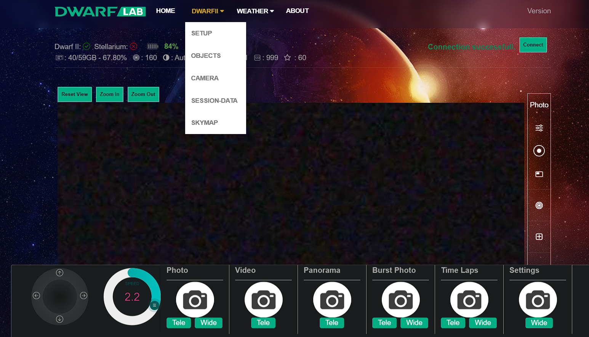
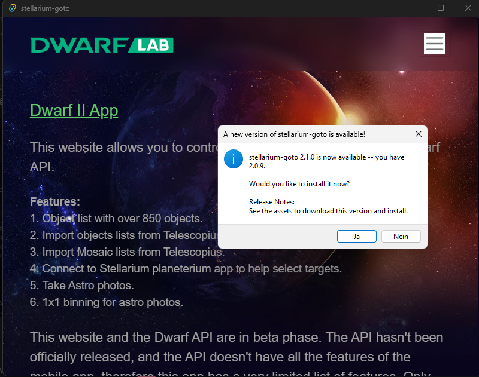

# Dwarfium


[](https://discord.gg/5vFWbsXDfv)

This website connects to the Dwarf II telescope to Stellarium via the [Dwarf II API](https://hj433clxpv.feishu.cn/docx/MiRidJmKOobM2SxZRVGcPCVknQg) and Stellarium remote control plugin. Once Dwarf II and Stellarium are connected, you can select an object in Stellarium, and then tell Dwarf II to go to that object.

 –

# Dwarf II Session Data

You have access to your session data for inspection and Download

 –

# Dwarf II Camera

You can control the telescope the same way as in the app.

 –

# Automated updates for Application Version

The Desktop Application is available for Windows, MAC Os and Linux

 –

# MAC OS

The Mac OS support has been canceld as we have no MACs available to provide dedicated support.
Running this Tools as a desktop application requires signing which is currently not possible for us.

You can still use Dwarfium with the provided web package [here](https://github.com/stevejcl/dwarfii-stellarium-goto/releases)

## Setup for coders

If you are interested in seeing how the code works or contributing to the project, then follow these steps.

This app is built with Next.js, Typescript, and Bootstrap css. This app uses eslint and Prettier to lint and format the code.

1. Clone this repo.

2. Install libraries.

```bash
npm install
```

3. Start server.

```bash
npm run dev
```

4. Production ready build.

```bash
npm run buld
```

5. Build desktop App based on your OS

In order to build the desktop app you need to install [Rust](https://www.rust-lang.org/learn/get-started)

```bash
npm run tauri build
```

## Setup for non-coders

If you just want to get the site up and running on your machine, then follow these steps.

1. Download desired [Release](https://github.com/stevejcl/dwarfii-stellarium-goto/releases).

2. For Webbrowser version:

2.1 Unzip the file. A DwarfStellariumGoto directory will be created. The website is a static html site (html, javascript, and css), so it should work on any OS that can run a browser and a web server.

2.2. Start a server inside the DwarfStellariumGoto directory. I recommend using Python's webserver, but you can use any webserver you want.

```bash
cd DwarfStellariumGoto
python -m http.server
```

2.3. Visit the site in a browser. If you use the Python's server, visit [localhost:8000](http://localhost:8000/)

## Details

Stellarium remote control plugin starts a webserver that allows people to access Stellarium desktop app through a web browser. When people select an object in Stellarium, they can access information about that object through `http://<localhost or IP>:<port>/api/main/status`.

This app connects to `/api/main/status`, and parses the returned data to get the object name, right acension and declination. The app then sends a goto command to the DWARF II with RA, declination, latitude, and longitude data via Dwarf II API.

The Desktop App wraps the webservice in a windowed environment.
Rust is providing the webservice and serves the pages.
