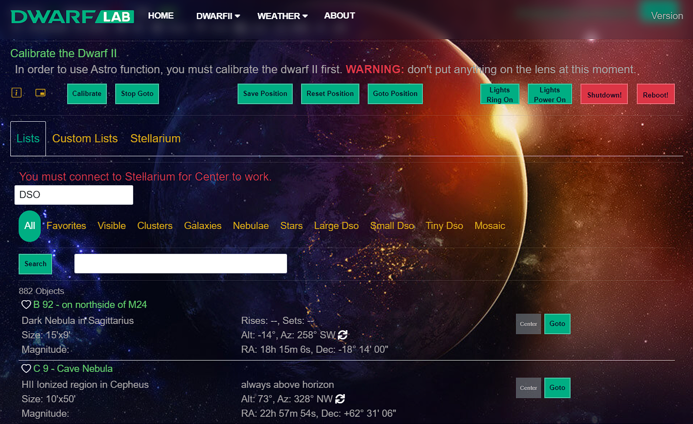

# Dwarfium


[](https://discord.gg/5vFWbsXDfv)


This application connects to the DWARF II telescope and integrates with Stellarium via the [DWARF II API](https://hj433clxpv.feishu.cn/docx/MiRidJmKOobM2SxZRVGcPCVknQg) and the Stellarium remote control plugin. Once DWARF II and Stellarium are connected, you can select an object in Stellarium and command DWARF II to point to that object.

You can find the documentation [here](https://tinyurl.com/Dwarfium).



## Features

### DWARF II Session Data

You can access and download your session data for inspection.


### DWARF II Camera

You can control the telescope just as you would with the official app.


### Automated Updates for Application Versions

The desktop application is available for Windows, macOS, and Linux.


### macOS Support

Support for macOS is limited as we do not have a Mac available for dedicated support. Running this tool as a desktop application requires signing, which is currently not feasible for us.

You can still use Dwarfium with the provided web package available [here](https://github.com/stevejcl/dwarfii-stellarium-goto/releases).

For Mac ARM users:
If you encounter an issue where the application can't be installed and should be moved to the trash, use the following command:

```bash
xattr -d com.apple.quarantine /Applications/Dwarfium.app
```

## Setup for Coders

If you're interested in exploring the code or contributing to the project, follow these steps:

This app is built with Next.js, TypeScript, and Bootstrap CSS. It uses ESLint and Prettier for linting and formatting the code.

1. Clone the repository.

2. Install the necessary libraries.

```bash
npm install
```

3. Start the server.

```bash
npm run dev
```

4. Create a production-ready build.

```bash
npm run build
```

5. Build the desktop app for your operating system.

To build the desktop app, you need to install [Rust](https://www.rust-lang.org/learn/get-started).

```bash
npm run tauri build
```

## Setup for Non-Coders

If you just want to get the site up and running on your machine, follow these steps:

1. Download the desired [release](https://github.com/stevejcl/dwarfii-stellarium-goto/releases).

2. For the web browser version:

   2.1. Unzip the file. A `DwarfStellariumGoto` directory will be created. The website is a static HTML site (HTML, JavaScript, and CSS), so it should work on any OS that can run a browser and a web server.

   2.2. Start a server inside the `DwarfStellariumGoto` directory. I recommend using Python's web server, but any web server will work.

   ```bash
   cd DwarfStellariumGoto
   python -m http.server
   ```

   2.3. Visit the site in a browser. If you're using Python's server, visit [localhost:8000](http://localhost:8000/).

## Technical Details

The Stellarium remote control plugin starts a web server that allows access to the Stellarium desktop app through a web browser. When you select an object in Stellarium, you can retrieve information about that object through `http://<localhost or IP>:<port>/api/main/status`.

This app connects to `/api/main/status` and parses the returned data to get the object's name, right ascension, and declination. It then sends a go-to command to the DWARF II with the right ascension, declination, latitude, and longitude data via the DWARF II API.

The desktop app wraps the web service in a windowed environment. Rust provides the web service and serves the pages.
